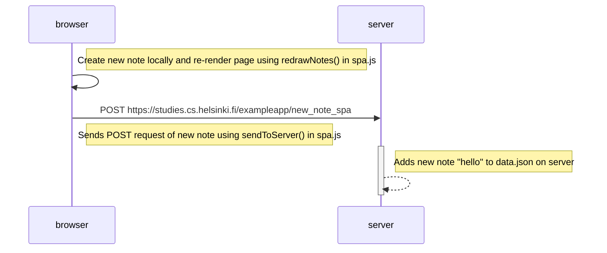

```mermaid
sequenceDiagram
    participant browser
    participant server

    Note right of browser: Create new note locally and re-render page using redrawNotes() in spa.js
    browser->>browser: 

    browser->>server: POST https://studies.cs.helsinki.fi/exampleapp/new_note_spa

    Note right of browser: Sends POST request of new note using sendToServer() in spa.js

    activate server

    Note right of server: Adds new note "hello" to data.json on server 
    server-->>server: 
    
    deactivate server
```